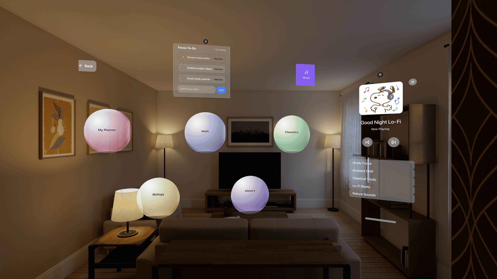

## Project Overview

MindOrbit is a spatial productivity workspace that reimagines studying and organization in 3D. Built with React, TypeScript, and WebSpatial, it lets users arrange floating panels for notes, music, and planning in an interactive, XR-ready environment that feels natural and immersive.

This app was build within the Web To Spatial program.



*MindOrbit running on Apple Vision Pro Simulator*

## Features

### Spatial Workspace
- Arrange floating panels for notes, music, and planning in a 3D space.
- Move, resize, and organize panels freely using drag and drop.

### Music Player
- Floating music scene with lo-fi and hype playlists for different moods.
- Animated keynotes and floating visuals that react to the music.

### Subject Tabs
- Each subject has its own floating note panel.
- Customize background colors, small themes, and environment moods.

### My Planner
- Floating planner tab that includes class schedules, to-do lists, and personal notes.
- Always visible and easy to access while you work.


## Technology Stack

- **XR Support**: WebSpatial SDK for extended reality features
- **Frontend**: React 18, TypeScript
- **Styling**: Tailwind CSS, CSS 3D Transforms
- **UI Components**: Radix UI primitives
- **Icons**: Lucide React
- **Build Tool**: Vite


## Prerequisites

- Node.js 18+ 
- npm or yarn package manager
- Modern browser with WebGL support
- Apple Vision Pro or Macbook with AVP simulator

## Installation & Setup

1. **Clone the repository**
   ```bash
   git clone https://github.com/aungbbo/XRHacks25
   cd "XRHacks25
   ```

2. **Install dependencies**
   ```bash
   npm install
   ```

3. **Start development server**
   ```bash
   npm run dev
   ```

4. **Open in browser**

   Navigate to `http://localhost:3000`

5. **Generate AVP-specific code**
 ```bash
   XR_ENV=avp npm run dev
   ```

6. **Start XR development server**
  ```bash
    npx webspatial-builder run --base=$XR_DEV_SERVER
  ```

Replace $XR_DEV_SERVER with the URL generated by XR_ENV=avp npm run dev in the previous step.


7. **Access XR app**

Wait for Apple Vision Pro Simulator to start or access the URL generated by the fifth step. 


## License 

This project is released under the **MIT License**. See the full license [here](LICENSE).


## Demo 

[Devpost](https://devpost.com/software/abc-4ogw9r) (Complete application demo showing all features and more details in action)